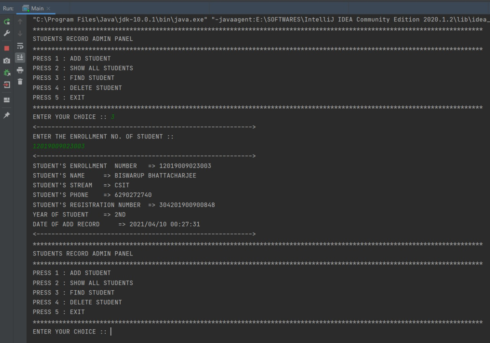
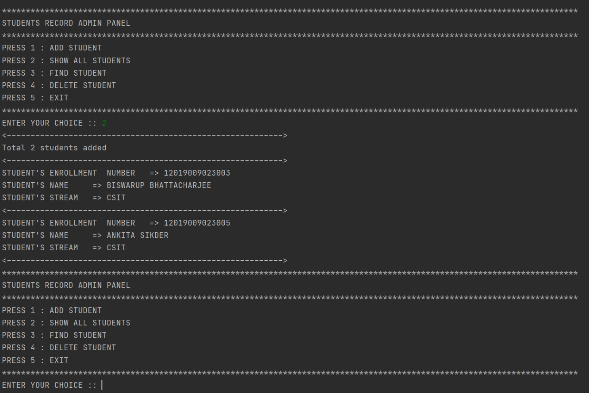
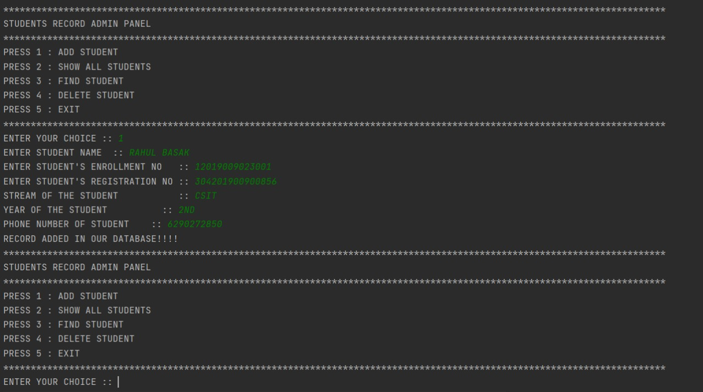
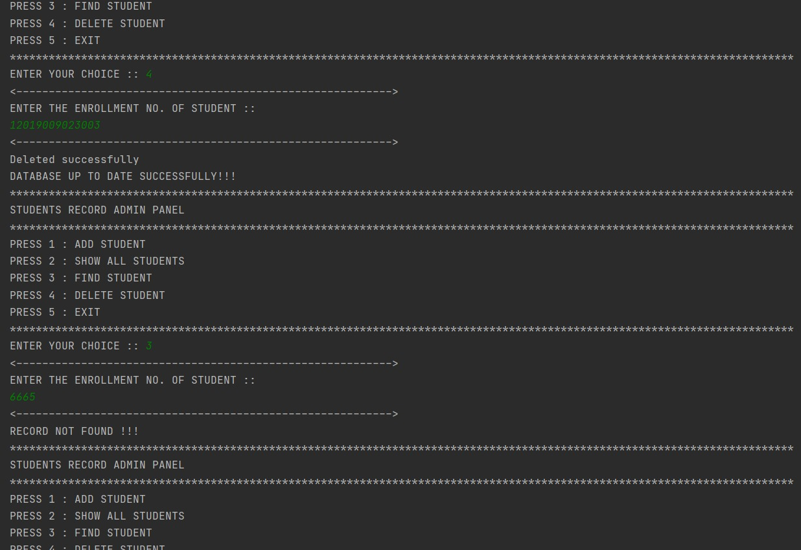

# LIBRARY-MANAGEMENT-SYSTEM-FILE-HANDLING-JAVA :star_struck: :open_file_folder: :computer: :closed_book:

[](https://shields.io/) [](https://shields.io/) [](https://shields.io/)
<br>

***This new LIBRARY-MANAGEMENT-SYSTEM-FILE-HANDLING-JAVA is created by Biswarup Bhattacharjee, student of BTECH, in University of Engineering and Management, Kolkata.***

**Email Id: bbiswa471@gmail.com.** 

**Contact No: 916290272740.** 


<p align="left">
<a href="https://www.facebook.com/profile.php?id=100070395300810" target="blank"></a>
<a href="https://instagram.com/biswarup2210" target="blank"></a>
<a href="https://github.com/biswa2210/biswa2210" target="blank"></a>
</p>

## About :point_down: 

<div align="justified">
 


</div>

## Purpose :point_down:

<div align="justified">

</div>

## Use :point_down:

<div align="justified">
 

</div>

## Applications :point_down:

<div align="justified">
 

 </div>

## Future Scopes :point_down:

<div align="justified">
 

</div>

## Folder Structure :point_down:

```bash
 LIBRARYMANAGEMENTSystemFileHandlingJava
              ├── .idea
              |      ├── description.html
              |      ├── encodings.xml
              |      ├── misc.xml
              |      ├── modules.xml
              |      └── project.template.xml
              ├── Out
              |     └── production
              |              └── Library Management System
              |                             └── com
              |                                   └── Array Operations
              |                                              ├── Main.class
              |                                              ├── Logic.class
              |                                              └── menu.class
              ├── src
              |     └── com
              |           └── Array Operations
              |                      └── Main.java
              └──  LIBRARY MANAGEMENT SYSTEM.iml
```

<details>
    <summary>
        "To read about making this project click here"

   </summary>

## Making :point_down:

I have made this project using Java Programming Language. Here I have created the functionalities. Here the record is created in a record.txt file. When we delete or update a record then the older file get deleted and new file is created here. I have used Idea Inteelij for java.
 
</details>
    
## Screenshots :point_down: 

<div align="center">

<a href="pics/sfj1.jpeg"></a>

<a href="pics/sfj2.jpeg"></a>

<a href="pics/sfj3.jpeg"></a>

<a href="pics/sfj4.jpeg"></a>
</div>


