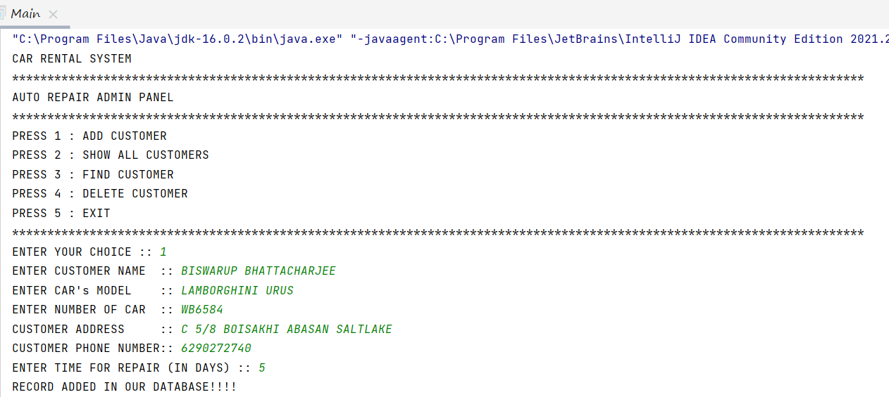
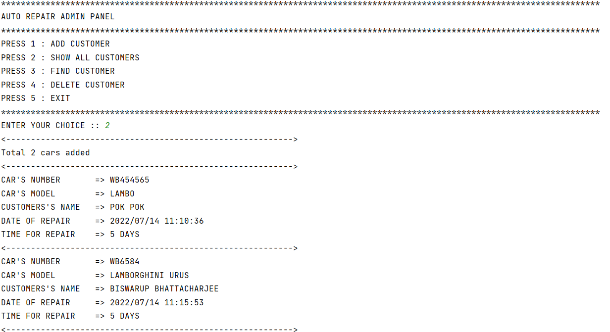
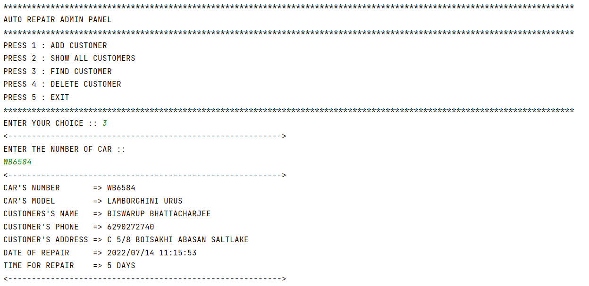
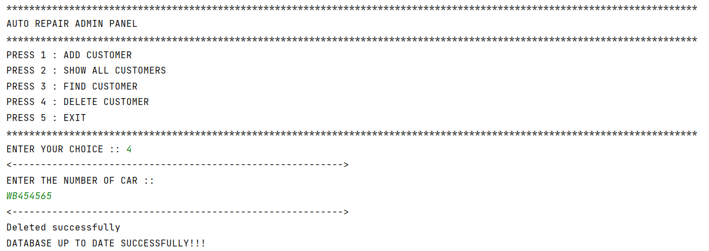
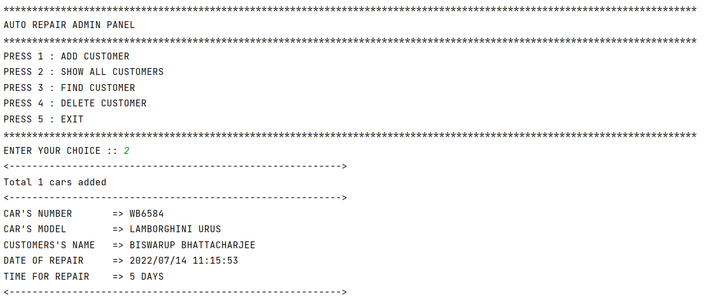

# AUTO-REPAIR-SYSTEM-FILE-HANDLING-JAVA :star_struck: :open_file_folder: :computer: :closed_book:

[](https://shields.io/) [](https://shields.io/) [](https://shields.io/)
<br>

***This new AUTO-REPAIR-SYSTEM-FILE-HANDLING-JAVA is created by Biswarup Bhattacharjee, student of BTECH, in University of Engineering and Management, Kolkata.***

**Email Id: bbiswa471@gmail.com.** 

**Contact No: 916290272740.** 


<p align="left">
<a href="https://www.facebook.com/profile.php?id=100070395300810" target="blank"></a>
<a href="https://instagram.com/biswarup2210" target="blank"></a>
<a href="https://github.com/biswa2210/biswa2210" target="blank"></a>
</p>

## About :point_down: 

<div align="justified">
 
This is a Java file handling project. Here in the main menu there are options to add customer record, search record, all record and delete record. All these are needed in an auto repair system.

</div>

## AUTO REPAIR SYSTEM(File Handling) DEMO VIDEO: :point_right: <a href="https://www.youtube.com/watch?v=IHUrqI9ZkS8&list=PL0lbDlMJ1h4hUbx_a40pP1nGYfTTvhf_0&index=3">Click here to watch</a>

## JAVA PLAYLIST: :point_right: <a href="https://www.youtube.com/watch?v=bCoFqFb76Jc&list=PL0lbDlMJ1h4hUbx_a40pP1nGYfTTvhf_0">Click here to watch</a>

## Folder Structure :point_down:

```bash
AutoRepairSystemFileHandlingJava
              ├── .idea
              |      ├── description.html
              |      ├── encodings.xml
              |      ├── misc.xml
              |      ├── modules.xml
              |      └── project.template.xml
              ├── Out
              |     └── production
              |              └── Auto Repair System
              |                             └── com
              |                                   └── Array Operations
              |                                              ├── Main.class
              |                                              ├── Logic.class
              |                                              └── menu.class
              ├── src
              |     └── com
              |           └── Array Operations
              |                      └── Main.java
              └── AUTO REPAIR SYSTEM.iml
```

## Making :point_down:

I have made this project using Java Programming Language. Here I have created the functionalities. Here the record is created in a record.txt file. When we delete or update a record then the older file get deleted and new file is created here. I have used Idea Inteelij for java.
 
</details>
    
## Screenshots :point_down: 

<div align="center">

<a href="auto1.png"></a>

<a href="auto2.png"></a>

<a href="auto3.png"></a>

<a href="auto4.png"></a>

<a href="auto5.png"></a>

</div>


